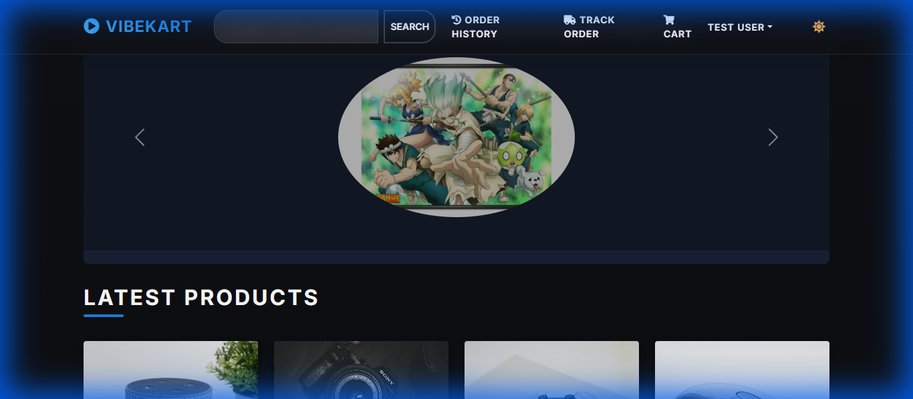
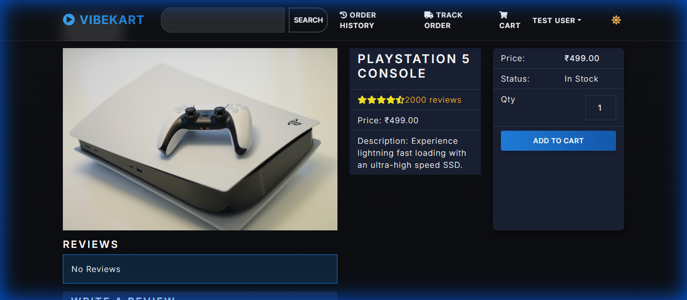
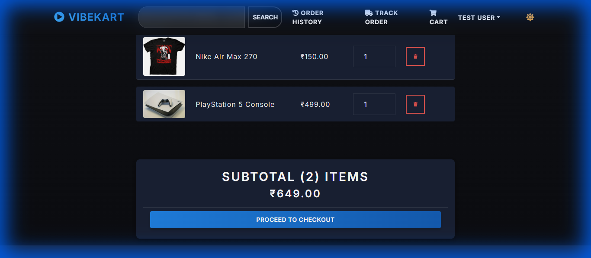
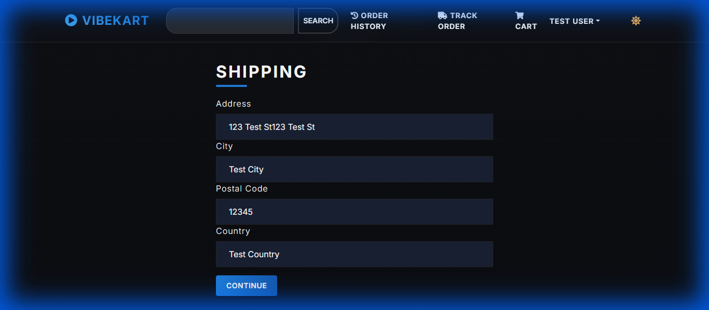
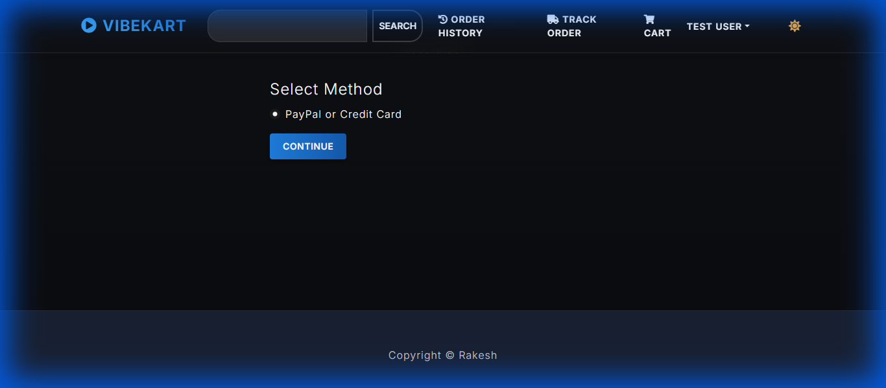
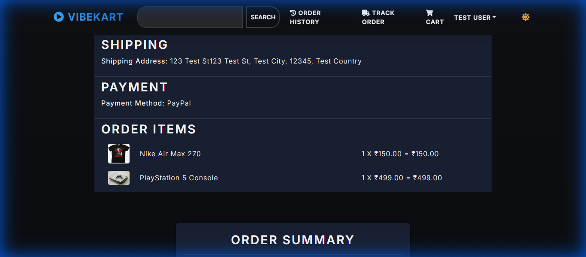

<h1 align="center">VibeKart</h1>
<h2 align="center">High-Quality Watches for Everyone</h2>

<p align="center">
  A premium E-Commerce platform built with the power of Django and React.
</p>

---

## 🚀 About the Project

VibeKart is a fully functional e-commerce application designed to provide a seamless shopping experience. It features a modern, responsive user interface and a robust backend to handle products, users, orders, and payments.

### Key Features
- **User Authentication**: Secure login and registration.
- **Product Management**: Browse, search, and filter watches.
- **Shopping Cart**: Add items, adjust quantities, and calculate totals.
- **Checkout Process**: Shipping address, payment method selection, and order placement.
- **PayPal Integration**: Secure payment processing.
- **User Profile**: Order history and profile management.
- **Admin Dashboard**: Manage users, products, and orders.
- **Product Reviews**: Users can rate and review products.

---

## �️ Tech Stack

### Frontend
- **React**: Library for building user interfaces.
- **Redux**: State management.
- **React Bootstrap**: UI framework.
- **Axios**: HTTP client.

### Backend
- **Django**: The web framework for perfectionists with deadlines.
- **Django REST Framework**: For building powerful Web APIs.
- **SQLite**: (Default) Database for development.
- **JWT**: JSON Web Token authentication.

---

## 🏃‍♀️ How to Run

You can run this project locally using Python directly or via Docker (if configured).

### Prerequisites
- Python 3.8+
- Node.js & npm (for frontend development)

### Local Setup

1.  **Clone the repository:**
    ```bash
    git clone https://github.com/kritebh/ecommerce-django-react.git
    cd ecommerce-django-react
    ```

2.  **Backend Setup:**
    ```bash
    # Create virtual environment
    python -m venv env
    
    # Activate virtual environment
    # Windows:
    .\env\Scripts\activate
    # Mac/Linux:
    # source env/bin/activate

    # Install dependencies
    pip install -r requirements.txt

    # Run migrations
    python manage.py migrate
    
    # Run the server
    python manage.py runserver
    ```

3.  **Frontend Setup:**
    The frontend is served by Django in production/preview mode, but for development:
    ```bash
    cd frontend
    npm install
    npm start
    ```

### 🐳 Run with Docker

If you have Docker installed:

```bash
docker-compose up --build
```
This will start the application containers.

---

## 👤 Author

**Rakesha N**
- *Python Full Stack Developer*
- 📧 Email: [rakesharakesha87@gmail.com](mailto:rakesharakesha87@gmail.com)

---

## 📷 Screenshots

### 📷 Project Screenshots








---
